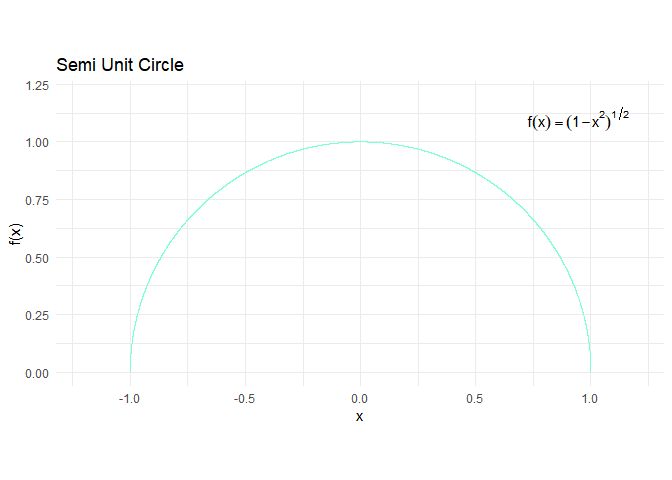
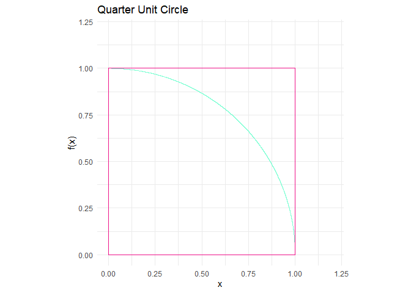
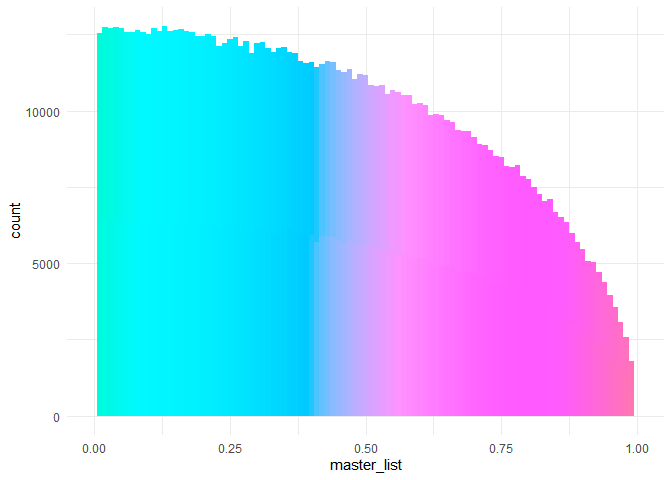

Monte Carlo and numeric estimations of pi
================
John Brown
9/2/2022

## Preface

Here I’ll approximate pi with a Monte Carlo simulation and through
integration. I’ll do this through use of a semi unit circle function:
$f(x) = (1-x^2)^\\frac{1}{2}$

``` r
library(ggplot2)
x = seq(-1, 1, .01)
fun <- function(x) {(1 - x^2)^.5}
y = fun(x)

half_circle = data.frame(x, y)

p <- ggplot() +
 geom_function(fun = fun, color = "aquamarine") +
 xlim(c(-1.2,1.2)) +
 ylim(c(0, 1.2)) +
 theme_minimal() +
 coord_fixed()
  
p
```

    ## Warning: Removed 18 row(s) containing missing values (geom_path).

<!-- -->

## Quarter unit circle

To simplify the simulation, I’ll set the x axis limits from 0 to 1. This
gives a quarter of the unit circle. Around it, I’ll plot the unit square

``` r
plot.new()

curve(fun(x),asp = 1, col = "red")
rect( 0, 0, 1, 1)
```

<!-- -->

Since the radius of the unit circle is 1 and the formula for the area of
a circle is *π**r*<sup>2</sup>, the area of the unit circle is *π*.
Therefore the area of the quarter unit circle is $\\frac{\\pi}{4}$. For
a Monte Carlo estimation of *π* I’ll sample from a bivariate standard
uniform distribution. The standard uniform distribution has an equal
probability of producing values from 0 to 1. So, each bivariate sample
will be a point within the bounds of the unit square, see below:

``` r
plot.new()
# bivariate sampling from the standard uniform distrubution
x <- runif(100, 0, 1)
y <- runif(100, 0, 1)

curve(fun(x), asp = 1, col = "red")
points(x, y)
rect( 0, 0, 1, 1)
```

<!-- -->

## Monte Carlo simulation

Now I’ll run the Monte Carlo simulation

``` r
# Makes a list of 10 lists that will each contain 2K  newly generated points over 
#50 iterations to reach 1 mil points
l1 <- list()

list_of_list <- list(l1,l1,l1,l1,l1,l1,l1,l1,l1,l1)

# Makes histogram of Monte Carlo simulation
num_attempts = 0
master_list = list()

for (itr in 1:50)
{
  for (idx in 1:10)
  {
    while (length(list_of_list[[idx]]) < 200)
      {
        x1 = runif(1, 0, 1)
        y1 = runif(1, 0, 1)
        radicand = x1^2 + y1^2
          if (sqrt(radicand) <= 1)
          {
            list_of_list[[idx]] <- append(list_of_list[[idx]], x1)
            radicand = NULL
          }
        num_attempts = num_attempts +1
        
      }
  }
  points <- unlist(list_of_list)
  master_list <- append(master_list, points)
  list_of_list <- list(l1,l1,l1,l1,l1,l1,l1,l1,l1,l1)
}


master_list <- unlist(master_list)
hist(master_list)
```

<!-- -->
