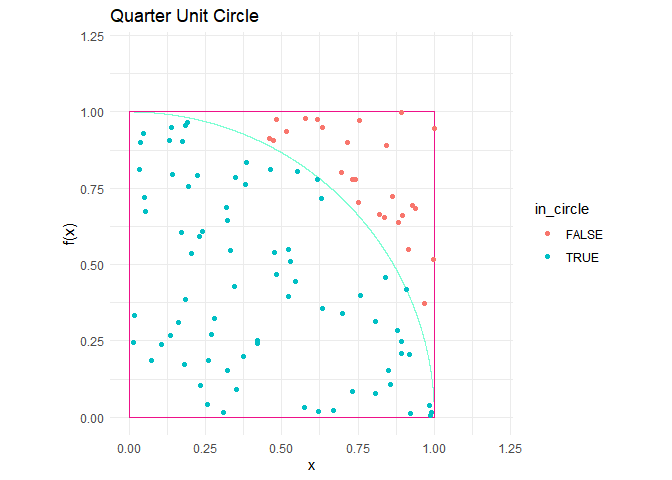

Monte Carlo and numeric estimations of pi
================
John Brown
9/2/2022

## Preface

Here I’ll approximate pi with a Monte Carlo simulation and through
integration. I’ll do this through use of a semi unit circle function:
$f(x) = (1-x^2)^\\frac{1}{2}$

``` r
#install.packages("latex2exp")
library(latex2exp)
library(ggplot2)

x = seq(-1, 1, .0001)
fun <- function(x) {(1 - x^2)^.5}
y = fun(x)

half_circle = data.frame(x, y)

p <- ggplot(half_circle, aes(x = x, y= y)) +
  geom_line(color = "aquamarine") +
  theme_minimal() +
  coord_fixed() +
  labs(y = "f(x)") 
  
p + 
  xlim(c(-1.2,1.2)) +
  ylim(c(0, 1.2))+
  annotate("text", x = .95, y= 1.1, label = TeX("$f(x) = (1-x^2)^{1/2}$"), parse = TRUE) +
  labs(title = "Semi Unit Circle")
```

    ## Warning in is.na(x): is.na() applied to non-(list or vector) of type
    ## 'expression'

<!-- -->

## Quarter unit circle

To simplify the simulation, I’ll set the x axis limits from 0 to 1. This
gives a quarter of the unit circle. Around it, I’ll plot the unit square

``` r
x_coords = c(0, 1, 0, 1)
y_coords = c(0, 0, 1, 1)
unit_square = data.frame(x_coords, y_coords)

quarter_p = p + 
  xlim(c(0,1.2)) +
  ylim(c(0, 1.2)) +
  geom_rect(aes(xmin = 0, xmax = 1, ymin = 0, ymax = 1), fill = NA, col = "deeppink2") +
  labs(title = "Quarter Unit Circle")

quarter_p
```

    ## Warning: Removed 10000 row(s) containing missing values (geom_path).

<!-- -->

Since the radius of the unit circle is 1 and the formula for the area of
a circle is *π**r*<sup>2</sup>, the area of the unit circle is *π*.
Therefore the area of the quarter unit circle is $\\frac{\\pi}{4}$. For
a Monte Carlo estimation of *π* I’ll sample from a bivariate standard
uniform distribution. The standard uniform distribution has an equal
probability of producing values from 0 to 1. So, each bivariate sample
will be a point within the bounds of the unit square, see below:

``` r
library(dplyr)
```

    ## 
    ## Attaching package: 'dplyr'

    ## The following objects are masked from 'package:stats':
    ## 
    ##     filter, lag

    ## The following objects are masked from 'package:base':
    ## 
    ##     intersect, setdiff, setequal, union

``` r
# bivariate sampling from the standard uniform distrubution
x_sample <- runif(100, 0, 1)
y_sample <- runif(100, 0, 1)

bivariate_df <- data.frame(x_sample, y_sample)
bivariate_df <- bivariate_df %>%
  mutate(in_circle = sqrt(x_sample^2 + y_sample^2) <= 1)

quarter_p + 
  geom_point(data = bivariate_df, aes(x_sample , y_sample, col = in_circle)) 
```

    ## Warning: Removed 10000 row(s) containing missing values (geom_path).

<!-- -->

The above plot shows 100 randomly sampled points. If we count the number
of (x, y) pairs the satisfy $\\sqrt{x^2 + y^2} \\ \\leq \\ 1$ (blue
dots) and divide by the total number of points sampled (100), we will
get the proportion of points that fell within the quarter unit circle.
this should approximate $\\frac{\\pi}{4}$

## Monte Carlo simulation

I’ll now repeat this process with 1 million points and plot distrubution
of points that satisfy $\\sqrt{x^2 + y^2} \\ \\leq \\ 1$ The shape of
the histogram should approximate the are under the quarter unit circle

``` r
# Makes a list of 10 lists that will each contain 2K  newly generated points over 
#50 iterations to reach 1 mil points
l1 <- list()

list_of_list <- list(l1,l1,l1,l1,l1,l1,l1,l1,l1,l1)

# Makes histogram of Monte Carlo simulation
num_attempts = 0
master_list = list()

for (itr in 1:50)
{
  for (idx in 1:10)
  {
    while (length(list_of_list[[idx]]) < 2000)
      {
        x1 = runif(1, 0, 1)
        y1 = runif(1, 0, 1)
        radicand = x1^2 + y1^2
          if (sqrt(radicand) <= 1)
          {
            list_of_list[[idx]] <- append(list_of_list[[idx]], y1)
            radicand = NULL
          }
        num_attempts = num_attempts +1
        
      }
  }
  points <- unlist(list_of_list)
  master_list <- append(master_list, points)
  list_of_list <- list(l1,l1,l1,l1,l1,l1,l1,l1,l1,l1)
}


master_list <- unlist(master_list)
master_list <- data.frame(master_list)

ggplot(master_list, aes(x = master_list, fill = cut(master_list,100))) +
  geom_histogram(show.legend = FALSE, binwidth = 0.01,) +
  theme_minimal() +
  xlim(0,1) +
  scale_fill_discrete(h = c(180, 360), c = 150, l = 80)
```

    ## Warning: Removed 200 rows containing missing values (geom_bar).

<!-- -->

Now 1,000,000 divided by the total number of points generated will give
us an approximation of the area under the Quarter unit circle. When this
number is multiplied by 4 we get an estimation of pi

``` r
prop_in_circle = 1000000 / num_attempts
MC_pi <- prop_in_circle * 4
MC_pi
```

    ## [1] 3.141942

## Numeric estimation of pi

For a numerical estimate of pi, we simply integrate under the Quarter
unit circle function. Below I’ll show
$\\pi \\approx\\int\_0^1 \\left(1-x^2\\right)^{\\frac{1}{2}} dx \\ \\ \* \\ 4$

``` r
integrand = function(x) {(1-x^2)^.5}
quarter_area <- 0.7853983
pi_est <- quarter_area * 4
pi_est
```

    ## [1] 3.141593
